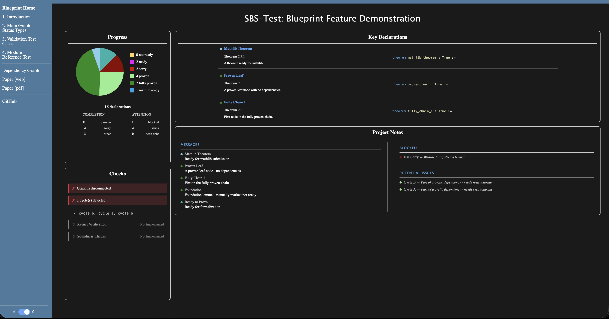
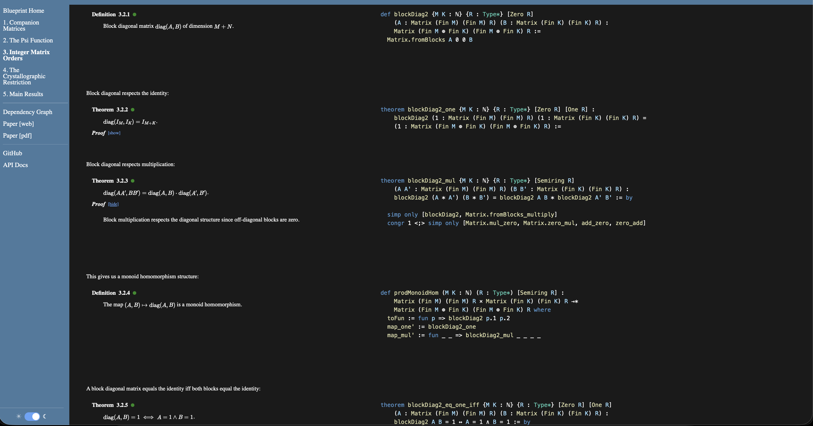
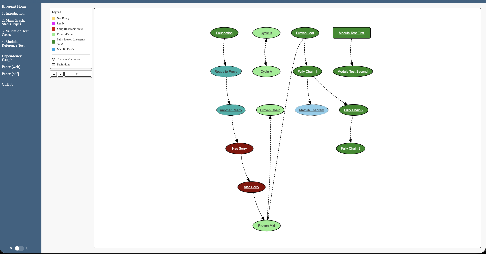
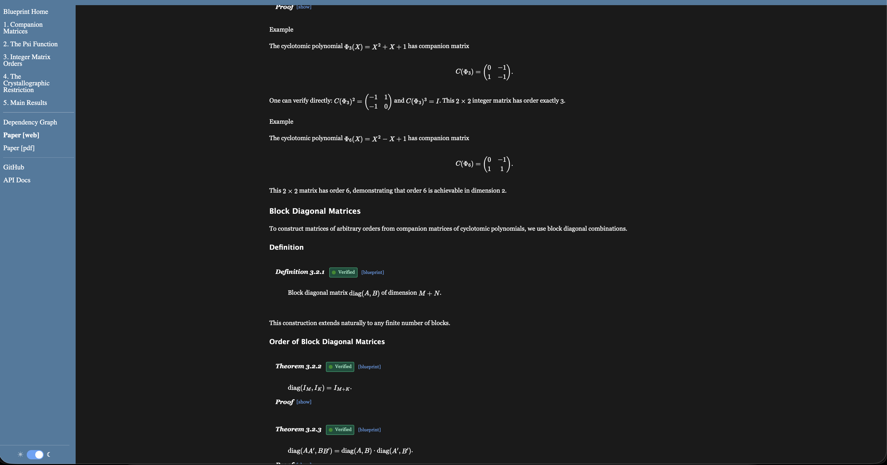

# SBS-Test


Minimal test project for the [Side-by-Side Blueprint](https://github.com/e-vergo/Side-By-Side-Blueprint) toolchain. Fast iteration environment for toolchain development and feature demonstration.

**Live site:** [e-vergo.github.io/SBS-Test](https://e-vergo.github.io/SBS-Test/)

## Purpose

SBS-Test provides a controlled environment for testing all features of the blueprint system with fast iteration times (~2 minutes vs. 20+ minutes for production projects). It serves as:

1. **Development testbed** - Fast feedback loop when making toolchain changes
2. **Feature demonstration** - All 6 status colors, 8 metadata options, 3 manual flags
3. **Validation testing** - Intentional graph errors (cycles, disconnected components)
4. **Security testing** - XSS prevention across all user-controlled fields
5. **Visual regression baseline** - Reference screenshots for compliance validation

The project contains 33 `@[blueprint]` annotated declarations across 4 Lean files plus 1 pure LaTeX node.

## Features Tested

| Category | Coverage |
|----------|----------|
| Status colors | All 6: notReady, ready, sorry, proven, fullyProven, mathlibReady |
| Metadata options | All 8: title, keyDeclaration, message, priorityItem, blocked, potentialIssue, technicalDebt, misc |
| Manual status flags | All 3: notReady, ready, mathlibReady |
| Graph validation | Disconnected component detection, cycle detection |
| Rainbow brackets | Nesting depths 1-10, all bracket types, color wrap-around |
| Module references | `\inputleanmodule{ModuleName}` expansion |
| Security | XSS prevention in all user-controlled fields |
| Output formats | Dashboard, side-by-side pages, dependency graph, paper (HTML + PDF) |

## Node Inventory (33 Total)

### StatusDemo.lean (14 nodes)

Demonstrates all 6 status colors and graph validation:

| Label | Status | Source | Purpose |
|-------|--------|--------|---------|
| `foundation` | notReady | Manual flag | Tests `(notReady := true)` override |
| `ready_to_prove` | ready | Manual flag | Tests `(ready := true)` |
| `another_ready` | ready | Manual flag | Second ready node |
| `has_sorry` | sorry | Auto-detected | Contains `sorry` in proof |
| `also_sorry` | sorry | Auto-detected | Second sorry node |
| `proven_leaf` | fullyProven | Auto-computed | Complete proof, no dependencies |
| `proven_mid` | proven | Auto-detected | Complete proof, has sorry dependency |
| `proven_chain` | proven | Auto-detected | Continues dependency chain |
| `fully_chain_1` | fullyProven | Auto-computed | First in verified chain |
| `fully_chain_2` | fullyProven | Auto-computed | Second in verified chain |
| `fully_chain_3` | fullyProven | Auto-computed | Third in verified chain |
| `mathlib_theorem` | mathlibReady | Manual flag | Tests `(mathlibReady := true)` |
| `cycle_a` | proven | Auto-detected | Part of disconnected cycle |
| `cycle_b` | proven | Auto-detected | Part of disconnected cycle |

**Graph structure:** Main component has 12 connected nodes plus `base_axiom` (pure LaTeX). Two nodes (`cycle_a`, `cycle_b`) form a disconnected cycle for validation testing.

### BracketDemo.lean (8 nodes)

Tests rainbow bracket highlighting:

| Label | Description |
|-------|-------------|
| `bracket:nested` | 3 levels of nested parentheses |
| `bracket:function` | Mixed brackets in function definition |
| `bracket:types` | Implicit type parameters with curly braces |
| `bracket:deep` | 8 levels testing color wrap-around |
| `bracket:mixed_deep` | All bracket types at depth 7+ |
| `bracket:complex` | Realistic filtering function |
| `bracket:realistic` | Pattern matching with comments |
| `bracket:extreme` | 10 levels for stress testing |

### ModuleRefTest.lean (2 nodes)

Tests `\inputleanmodule{ModuleName}` feature:

| Label | Description |
|-------|-------------|
| `mod:first` | First declaration in module |
| `mod:second` | Second declaration, depends on first |

### SecurityTest.lean (8 nodes)

Tests XSS prevention in user-controlled fields:

| Label | Attack Vector |
|-------|---------------|
| `xss_title` | Script tag in title field |
| `xss_message` | Img onerror handler in message |
| `xss_blocked` | SVG onload handler in blocked |
| `xss_issue` | Iframe javascript: URL in potentialIssue |
| `xss_debt` | Event handler in technicalDebt |
| `xss_misc` | Javascript URL in misc |
| `xss_label` | Mixed escaped/unescaped HTML |
| `xss_quotes` | Quote injection in attributes |

### blueprint.tex (1 pure LaTeX node)

| Label | Description |
|-------|-------------|
| `base_axiom` | Pure LaTeX axiom with no Lean code (notReady status) |

## Project Structure

```
SBS-Test/
├── SBSTest.lean              # Library root (imports all modules)
├── SBSTest/
│   ├── StatusDemo.lean       # 14 nodes: status colors, validation
│   ├── BracketDemo.lean      # 8 nodes: rainbow bracket testing
│   ├── ModuleRefTest.lean    # 2 nodes: module reference testing
│   ├── SecurityTest.lean     # 8 nodes: XSS prevention testing
│   ├── Blueprint.lean        # Verso SBSBlueprint document
│   └── Paper.lean            # Verso paper document
├── runway/
│   └── src/
│       ├── blueprint.tex     # Main LaTeX blueprint
│       └── paper.tex         # Paper with status badges
├── GenerateBlueprint.lean    # Verso blueprint generator executable
├── GeneratePaper.lean        # Verso paper generator executable
├── runway.json               # Site configuration
├── lakefile.toml             # Lake build configuration
├── scripts/
│   └── build_blueprint.sh    # Build script wrapper
└── images/                   # Screenshots for documentation
```

## Building

### Local Development

From the Side-by-Side-Blueprint monorepo:

```bash
cd /path/to/Side-By-Side-Blueprint/SBS-Test
python ../scripts/build.py
```

Or using the shell wrapper:

```bash
./scripts/build_blueprint.sh
```

### Build Steps

The build script executes:

1. Validate project (check runway.json, extract projectName)
2. Kill existing servers on port 8000
3. Sync repos to GitHub (commits and pushes all changes)
4. Update lake manifests in dependency order
5. Clean all build artifacts
6. Build toolchain (SubVerso -> LeanArchitect -> Dress -> Runway)
7. Fetch mathlib cache
8. Build project with `BLUEPRINT_DRESS=1`
9. Build `:blueprint` facet
10. Generate dependency graph
11. Generate site with Runway
12. Generate paper (HTML + PDF)
13. Start server at http://localhost:8000

**Expected build time:** ~2 minutes (vs. ~5 minutes for GCR, ~20 minutes for PNT)

### Manual Build Steps

If you need to run individual steps:

```bash
# Fetch mathlib cache
lake exe cache get

# Build with artifact generation
BLUEPRINT_DRESS=1 lake build

# Generate Lake facets
lake build :blueprint

# Generate dependency graph and manifest
lake exe extract_blueprint graph SBSTest

# Generate site
lake exe runway build runway.json
```

### CI/CD

GitHub Actions workflow (`.github/workflows/full-blueprint-build-and-deploy.yml`):

```yaml
name: Full Blueprint Build and Deploy

on:
  workflow_dispatch:

permissions:
  contents: read
  pages: write
  id-token: write

jobs:
  build:
    runs-on: ubuntu-latest
    steps:
      - uses: actions/checkout@v4
      - uses: e-vergo/dress-blueprint-action@main

  deploy:
    needs: build
    if: github.ref == 'refs/heads/main'
    runs-on: ubuntu-latest
    environment:
      name: github-pages
      url: ${{ steps.deployment.outputs.page_url }}
    steps:
      - uses: actions/deploy-pages@v4
```

Trigger manually via GitHub Actions UI.

## Output Locations

### Dressed Artifacts

Located in `.lake/build/dressed/`:

```
.lake/build/dressed/
├── SBSTest/
│   ├── StatusDemo/
│   │   ├── foundation/
│   │   │   ├── decl.tex          # LaTeX source
│   │   │   ├── decl.html         # Syntax-highlighted HTML
│   │   │   ├── decl.json         # Metadata
│   │   │   └── decl.hovers.json  # Hover tooltip data
│   │   └── ...
│   ├── BracketDemo/
│   ├── ModuleRefTest/
│   └── SecurityTest/
└── library/
    └── SBSTest.tex               # Aggregated LaTeX definitions
```

### Site Output

Located in `.lake/build/runway/`:

| File | Content |
|------|---------|
| `index.html` | Dashboard: stats, key theorems, messages, project notes |
| `dep_graph.html` | Interactive dependency graph with pan/zoom and modals |
| `manifest.json` | Precomputed stats, validation results, metadata |
| `paper.html` | Paper with MathJax rendering |
| `paper.pdf` | PDF output (if LaTeX compiler available) |
| `assets/` | CSS, JavaScript |

### What to Inspect

When verifying changes to the toolchain:

1. **Dashboard** (`index.html`)
   - Stats panel shows correct counts for all 6 statuses
   - Key Theorems panel lists nodes with `keyDeclaration := true`
   - Messages panel shows nodes with `message` field
   - Project Notes shows blocked/issues/debt/misc items

2. **Dependency Graph** (`dep_graph.html`)
   - Main component shows 31 connected nodes
   - Disconnected cycle (cycle_a, cycle_b) is separate
   - All 6 status colors appear correctly
   - Pan/zoom and modals function properly
   - Edge styles: solid (proof deps), dashed (statement deps)

3. **Chapter Pages**
   - Side-by-side LaTeX/Lean displays
   - Rainbow brackets with correct color cycling
   - Proof toggles expand/collapse in sync
   - Status dots in headers

4. **Manifest** (`manifest.json`)
   - `checkResults.connected`: false (due to disconnected cycle)
   - `checkResults.cycles`: contains `["cycle_a", "cycle_b"]`
   - `checkResults.componentCount`: 2
   - Stats match actual node counts

## Configuration

### runway.json

```json
{
  "title": "SBS-Test: Blueprint Feature Demonstration",
  "projectName": "SBSTest",
  "githubUrl": "https://github.com/e-vergo/SBS-Test",
  "baseUrl": "/SBS-Test/",
  "docgen4Url": null,
  "runwayDir": "runway",
  "assetsDir": "../dress-blueprint-action/assets"
}
```

| Field | Purpose |
|-------|---------|
| `projectName` | Must match the Lean library name in lakefile.toml |
| `runwayDir` | Directory containing `src/blueprint.tex` and `src/paper.tex` |
| `assetsDir` | Path to CSS/JS assets from dress-blueprint-action |

### lakefile.toml

```toml
name = "SBSTest"
defaultTargets = ["SBSTest"]

[leanOptions]
pp.unicode.fun = true
autoImplicit = false
relaxedAutoImplicit = false

[[require]]
name = "mathlib"
git = "https://github.com/leanprover-community/mathlib4.git"
rev = "v4.27.0"

[[require]]
name = "Dress"
git = "https://github.com/e-vergo/Dress.git"
rev = "main"

[[require]]
name = "verso"
git = "https://github.com/e-vergo/verso.git"
rev = "main"

[[lean_lib]]
name = "SBSTest"

[[lean_exe]]
name = "generate-blueprint-verso"
root = "GenerateBlueprint"

[[lean_exe]]
name = "generate-paper-verso"
root = "GeneratePaper"
```

## Validation Features

SBS-Test exercises graph validation checks that detect common blueprint errors:

### Disconnected Component Detection

The `cycle_a` and `cycle_b` nodes are not connected to the main graph. The validator reports:

```json
{
  "connected": false,
  "componentCount": 2,
  "componentSizes": [31, 2]
}
```

### Cycle Detection

`cycle_a` and `cycle_b` form a mutual dependency:

```json
{
  "cycles": [["cycle_a", "cycle_b"]]
}
```

These checks help catch logical errors in blueprint structure (e.g., the Tao incident where a disconnected lemma was not used in the main proof).

## Status Color Model

| Status | Color | Hex | Source |
|--------|-------|-----|--------|
| notReady | Sandy Brown | #F4A460 | Default or `(notReady := true)` |
| ready | Light Sea Green | #20B2AA | `(ready := true)` |
| sorry | Dark Red | #8B0000 | Auto-detected from proof |
| proven | Light Green | #90EE90 | Auto-detected (complete proof) |
| fullyProven | Forest Green | #228B22 | Auto-computed (all ancestors proven) |
| mathlibReady | Light Blue | #87CEEB | `(mathlibReady := true)` |

**Priority order** (highest to lowest): mathlibReady > ready > notReady (manual) > fullyProven > sorry > proven > notReady (default)

The `fullyProven` status is computed via O(V+E) graph traversal with memoization: a node is fullyProven if it is proven and all its ancestors are proven or fullyProven.

## Attribute Options Reference

### Metadata Options (8)

| Option | Example |
|--------|---------|
| `title` | `(title := "Foundation")` |
| `keyDeclaration` | `(keyDeclaration := true)` |
| `message` | `(message := "Ready for formalization")` |
| `priorityItem` | `(priorityItem := true)` |
| `blocked` | `(blocked := "Waiting for upstream lemma")` |
| `potentialIssue` | `(potentialIssue := "Edge case not handled")` |
| `technicalDebt` | `(technicalDebt := "Needs refactoring")` |
| `misc` | `(misc := "PR #12345 submitted")` |

### Manual Status Flags (3)

| Option | Effect |
|--------|--------|
| `(notReady := true)` | Sandy brown (#F4A460) |
| `(ready := true)` | Light sea green (#20B2AA) |
| `(mathlibReady := true)` | Light blue (#87CEEB) |

### Dependency Options

| Option | Effect |
|--------|--------|
| `(uses := ["label1", "label2"])` | Explicit statement dependencies |
| `(statement := /-- LaTeX with \uses{...} -/)` | Statement content |
| `(proof := /-- Proof explanation -/)` | Proof content |

## Screenshots


*Dashboard homepage: 2x2 grid with Stats, Key Theorems, Messages, Project Notes*


*Side-by-side theorem display with proof toggle*


*Interactive dependency graph with Sugiyama layout*


*Paper output with status badges*

## Visual Compliance Testing

SBS-Test serves as the reference project for visual compliance validation:

```bash
cd /path/to/Side-By-Side-Blueprint/scripts

# Capture screenshots after a build
python3 -m sbs capture --project SBSTest --interactive

# Run compliance validation
python3 -m sbs compliance --project SBSTest
```

The compliance system captures 8+ pages and validates them against expected criteria.

## Using as a Template

To create a new blueprint project based on SBS-Test:

1. **Clone and rename:**
   ```bash
   git clone https://github.com/e-vergo/SBS-Test MyProject
   cd MyProject
   rm -rf .git && git init
   ```

2. **Update configuration:**
   - `lakefile.toml`: Change `name = "SBSTest"` to your project name
   - `runway.json`: Update `title`, `projectName`, `githubUrl`, `baseUrl`
   - Rename `SBSTest/` directory and `SBSTest.lean` to match your project name

3. **Replace demo content:**
   - Delete contents of your renamed module directory
   - Create your own `@[blueprint]` annotated declarations
   - Update `runway/src/blueprint.tex` with your LaTeX structure
   - Optionally update `runway/src/paper.tex` for paper output

4. **Update imports:**
   - Edit your library root file to import your modules
   - Update `GenerateBlueprint.lean` and `GeneratePaper.lean` imports

5. **Build and verify:**
   ```bash
   python ../scripts/build.py
   # Open http://localhost:8000
   ```

## Related

### Toolchain

```
SubVerso -> LeanArchitect -> Dress -> Runway
              |
              +-> Verso (genres)
```

| Component | Purpose |
|-----------|---------|
| [SubVerso](https://github.com/e-vergo/subverso) | Syntax highlighting with O(1) indexed lookups |
| [LeanArchitect](https://github.com/e-vergo/LeanArchitect) | `@[blueprint]` attribute definition |
| [Dress](https://github.com/e-vergo/Dress) | Artifact generation, graph layout, validation |
| [Verso](https://github.com/e-vergo/verso) | Document genres (SBSBlueprint, VersoPaper) |
| [Runway](https://github.com/e-vergo/Runway) | Site generator |
| [dress-blueprint-action](https://github.com/e-vergo/dress-blueprint-action) | CI/CD action + CSS/JS assets |

### Projects

| Project | Description |
|---------|-------------|
| [Side-By-Side-Blueprint](https://github.com/e-vergo/Side-By-Side-Blueprint) | Parent monorepo with full toolchain |
| [General_Crystallographic_Restriction](https://github.com/e-vergo/General_Crystallographic_Restriction) | Production example with paper (57 nodes) |
| [PrimeNumberTheoremAnd](https://github.com/e-vergo/PrimeNumberTheoremAnd) | Large-scale integration (591 annotations) |

## License

Apache 2.0
